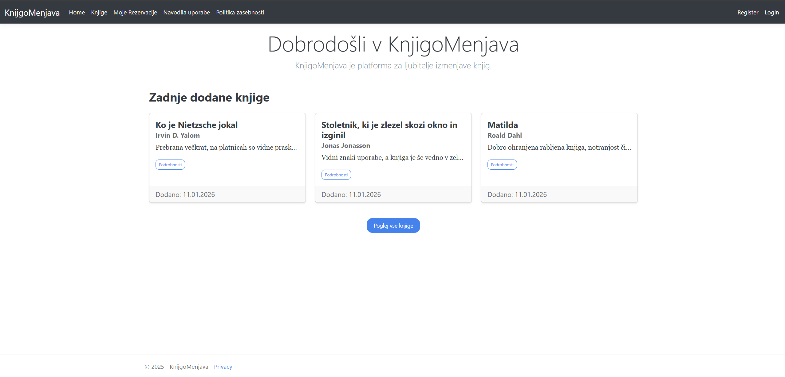
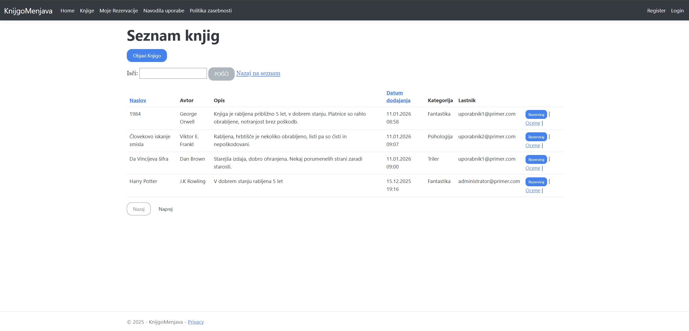
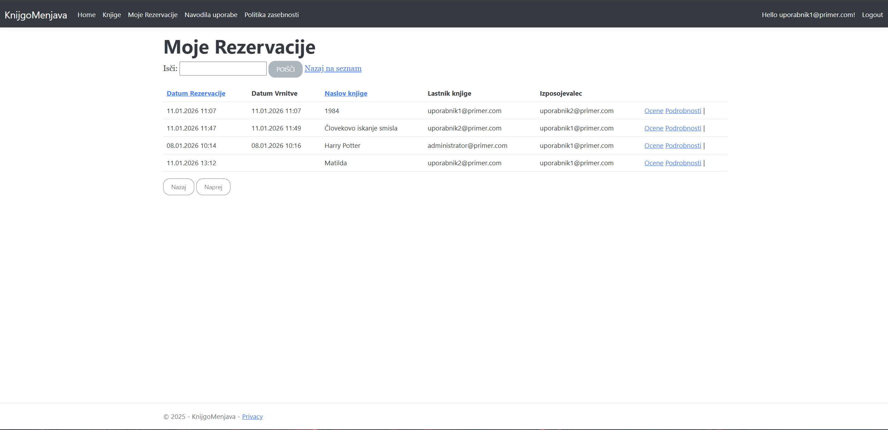
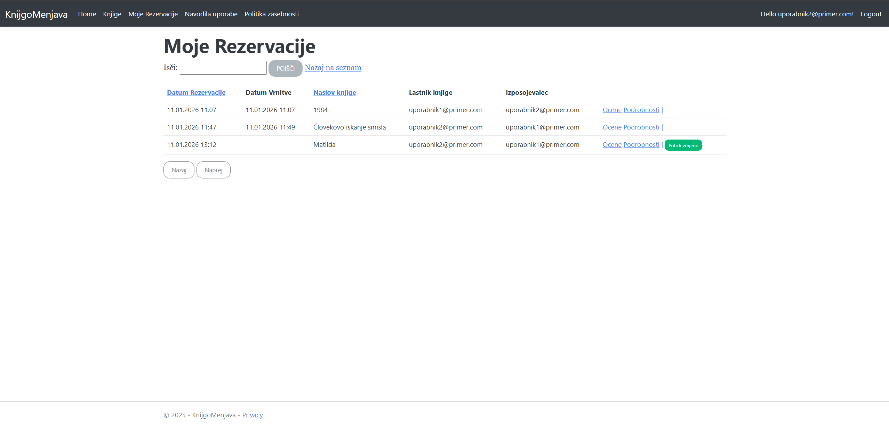

63240328 Teodor Todorović

KnjigoMenjava
*aplikacija trenutno ni zagnana (ustavljena na storitvi azure), sicer je dostopna na naslovu
knjigomenjava.azurewebsites.net

Informacijski sistem KnjigoMenjava bo omogočal proces izposoje knjig med uporabniki. Namen sistema je omogočiti posameznikom, da delijo svoje osebne knjige z drugimi uporabniki in si med seboj izposojajo knjige brez posredovanja knjižnice. Uporabniki lahko na enostaven način objavijo knjige, ki jih želijo posoditi, si izposodijo knjige drugih ter ocenijo knjige.
Predvideni entitetni tipi: Uporabnik, knjiga, kategorija, rezervacija, ocena

Uporabnik mora biti za objavo in izposojo knjig prijavljen. Na začetnem zaslonu so prikazane 3 nazadnje dodane knjige. Za pregled vseh možnih knjig, ki so na na voljo za izposojo in za objavo knjig mora uporabnik pritisniti na zavihek Knjige v zgornji vrstici. Pri objavi knjig lahko uporabnik izbire eno izmed kategorij, ki jih je objavil administrator. Za izposojo lahko uporabnik pritisne na gumb Rezerviraj in nato ta knjiga ne bo več vidna v seznam knjig. Knjiga bo nato vidna le pod zavihkom Moje Rezervacije, kjer so prikazene vse rezervirane knjige, kjer je prijavljen uporabnik ali izposojevaled ali pa lastnik knjige. Uporabnik se lahko nato preko e-pošte ki je podana pod lastnikom knjige zmeni za lokacijo in čas izposoje knjige. Ko lastnik dobi knjigo nazaj lahko v zavihku Moje Rezervacije pritisne gumb Potrdi vrnjeno, nakar knjiga postane spet razpoložljiva in se zabeleži dan in čas vrnitve.

Uporabnik lahko tudi v zavihku Knjige vidi ocene in komentarje posamezne knjige npr. da vidi, da je knjige dobro ohranjena.

Diagram podatkovnega modela je izdelan v orodju PowerDesigner.

